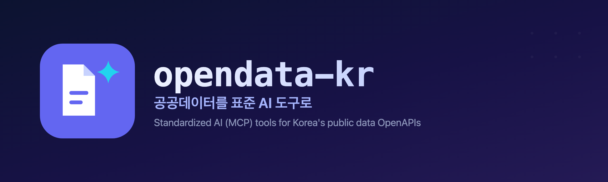

<!--
  이 파일은 opendata-kr 조직의 공개 프로필입니다.
  경로 규칙(GitHub 공식): 반드시 `<org>/.github` 리포의 `profile/README.md` 여야 org Overview 탭에 렌더됩니다.
  링크는 절대 URL을 씁니다. 프로필 README의 상대경로는 렌더 위치에 따라 깨질 수 있습니다.
  배너 이미지를 넣으려면 아래 주석을 해제하고 profile/images/banner.png 를 추가하세요.
-->
<!-- 

 -->

<h1 align="center">opendata-kr</h1>

  <strong>공공데이터포털(data.go.kr) OpenAPI를 위한 표준 AI 도구 모음</strong> 
  <em>Standardized AI tools for Korea's public data OpenAPIs.</em>

  
  
  

> [!NOTE]
> opendata-kr은 공공데이터포털(data.go.kr)과 무관한 독립 오픈소스 프로젝트입니다.
> 정부기관이 운영하지 않으며, data.go.kr의 공개 OpenAPI를 커뮤니티가 표준 도구로 감쌉니다.

---

## 무엇을 하나요

data.go.kr에는 수천 개의 공공 OpenAPI가 있지만 스펙, 인증, 응답 포맷이 서비스마다 제각각입니다.
opendata-kr은 각 서비스를 하나의 표준 AI 도구 규격(MCP 서버, `server.json`)으로 통일해, AI 에이전트와 개발자가 바로 쓰게 합니다.

## 시작하기

각 도구는 해당 리포의 README에 있는 설정으로 바로 실행합니다. 전체 목록은 [조직 리포 목록](https://github.com/orgs/opendata-kr/repositories)에서 찾을 수 있습니다.

## 리포지토리 구조

각 data.go.kr 서비스는 **별도의 리포지토리**입니다. 이름만 알면 리포를 바로 찾을 수 있도록, 네이밍 규약은 `<service-slug>-mcp` 하나로 고정합니다. 패키지는 `@opendata-kr/<service-slug>-mcp` 로 발행합니다.

## 로드맵

첫 확장 도메인은 나라장터 조달입니다. 판매자 관점의 경쟁입찰 프리세일즈 흐름을 단계별 MCP 도구로 제공합니다.

| 단계 | 목적 | 도구 | 설명 |
|---|---|---|---|
| 발주계획·조달요청 | 기회 선점 | 신규 예정 | 공고 전 발주를 미리 파악해 파이프라인을 확보 |
| 사전규격 | 규격 개입 | [narajangteo-prespec-mcp](https://github.com/opendata-kr/narajangteo-prespec-mcp) | 규격 초안을 확인하고 의견을 제출해 요건에 영향 |
| 입찰공고 | 투찰 판단 | [narajangteo-bid-mcp](https://github.com/opendata-kr/narajangteo-bid-mcp) | 공고와 참가자격, 기초금액으로 참여 여부를 결정 |
| 개찰·낙찰 | 결과 분석 | [narajangteo-opening-mcp](https://github.com/opendata-kr/narajangteo-opening-mcp) | 개찰 결과와 낙찰자로 낙찰가율을 분석 |
| 계약실적 | 경쟁 파악 | 신규 예정 | 경쟁사 계약 이력으로 단가와 수요기관을 벤치마크 |

## 왜 opendata-kr인가

- 일관성: 서비스마다 다시 파악할 필요 없이 같은 규약으로 씁니다.
- AI 네이티브: 표준 MCP 도구라 Claude 같은 에이전트에 바로 연결됩니다.
- 투명성: 모든 코드가 공개되어 있어, 도구가 어떤 원본 API를 호출하는지 추적할 수 있습니다.

## 함께하기

- 마음에 드는 도구 리포에 Star를 눌러주세요
- 버그, 제안: 각 도구 리포의 이슈, 전체 논의는 [Discussions](https://github.com/opendata-kr/.github/discussions)
- 기여 방법: [CONTRIBUTING](https://github.com/opendata-kr/.github/blob/main/CONTRIBUTING.md), [행동 강령](https://github.com/opendata-kr/.github/blob/main/CODE_OF_CONDUCT.md), [거버넌스](https://github.com/opendata-kr/.github/blob/main/GOVERNANCE.md)

## 라이선스

MIT. 각 리포의 `LICENSE` 를 참조하세요.
보안 취약점은 공개 이슈 대신 [SECURITY](https://github.com/opendata-kr/.github/blob/main/SECURITY.md) 절차로 신고해 주세요.
